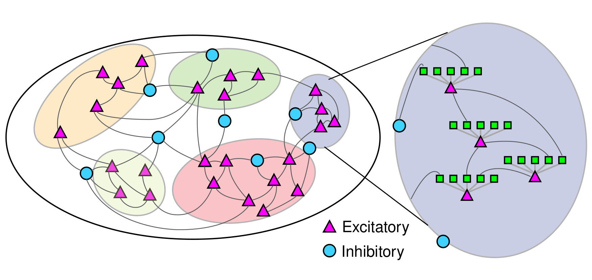

# Clustered Memory Network

- In this repository we use [NEST](https://github.com/nest/nest-simulator) to simulate of compartmental neurons with clustered connectivities
- The inter-neural connectivity is controlled by grouping neurons into densely connected clusters
- The intra-neural connectivity is controlled grouping the inputs of a pre-synaptic cluster onto a specific post-synaptic compartment

### Network details 

- Excitatory neurons are simplified multicompartment neurons of layer 5 pyramidal neurons. 
- Inhibitory neurons are single compartment neurons 
- The compartmental neurons have 5 dendritic compartments and the parameters are derived using [NEAT](https://github.com/WillemWybo/NEAT-2) (not required to run this model)


Fig 1. : Sketch of the network connectivity


Related publications:

1) Willem AM Wybo, Jakob Jordan, Benjamin Ellenberger, Ulisses Marti Mengual, Thomas Nevian, Walter Senn (2021) Data-driven reduction of dendritic morphologies with preserved dendro-somatic responses eLife 10:e60936 [DOI](https://doi.org/10.7554/eLife.60936)
2) Zajzon B, Mahmoudian S, Morrison A, Duarte R. Passing the Message: Representation Transfer in Modular Balanced Networks. Front Comput Neurosci. 2019 Dec 5;13:79. [DOI](10.3389/fncom.2019.00079)

## Installation

To run the simulations you you need [NEST](https://github.com/nest/nest-simulator) >= 3.3.  The documentation can be found [here](https://nest-simulator.readthedocs.io/en/v3.3/). I would suggest install nest into a virtual environment. 


## Code repository [optional]
- `main.py` the main script to run the simulation
- `create_figures.py` script to generate some basic figures

- `output` contains the simulation data
- `plots` contains output figures

## How to run
To run the network we can create a simple python script.

_example.py_
```python
from main import run, PostProcessing, Inhibition
from neuron import L5pyr_simp_sym
from neuron import Single_comp

run(
    job_name="test",
    n_cores=4,
    g=14.0,
    r=15.00,
    w=0.00025,
    rho=0.1,
    n_cl=5,
    n_dend=5,
    n=1250,
    mod=0.0,
    c=0.2,
    iw_fac=1.19,
    inp_type=Input.CONST_RATE,
    t_sim=1000,
    inp_str=0.1,
    tstep=50.0,
    steps=100,
    exc_neuron=L5pyr_simp_sym(),
    inh_neuron=Single_comp(),
    inhib=Inhibition.RAND_DEND,
    post_proc=PostProcessing.NETWORK_NMDA_STATS,
    rec_plottrace=False,
    rec_inp=False,
)
```
We can then run the network by simply running 
```bashv
python simulate.py`
```
```

